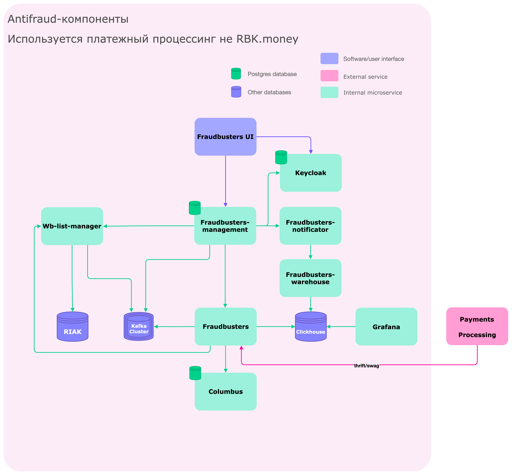

# fraudbusters-compose

### Topology

Fraudbusters is a central service that accepts templates from a management service and
responds to inspection requests from external systems, for checks in black / white / named lists.
Interacts with wb-list-manager based on protocol
[wb-list-proto](https://github.com/rbkmoney/wb-list-proto/blob/master/proto/wb_list.thrift)
also interacts with ClickHouse to collect aggregates and fill in the necessary audit data (JDBC).
When analyzing the results, it enriches the data from the storage location service by ip addresses
[Columbus](https://github.com/rbkmoney/damsel/blob/master/proto/geo_ip.thrift)



### Run

```docker-compose up -d```

### Service live at:

 - Grafana (http://localhost:3000) - admin/admin
 - Swagger for fraudbusters management (http://localhost:8080/fb-management/v1/swagger-ui.html)
 - Thrift proxy inspector proto fraudbusters (http://localhost:8022/...)

### License
[Apache 2.0 License.](/LICENSE)

