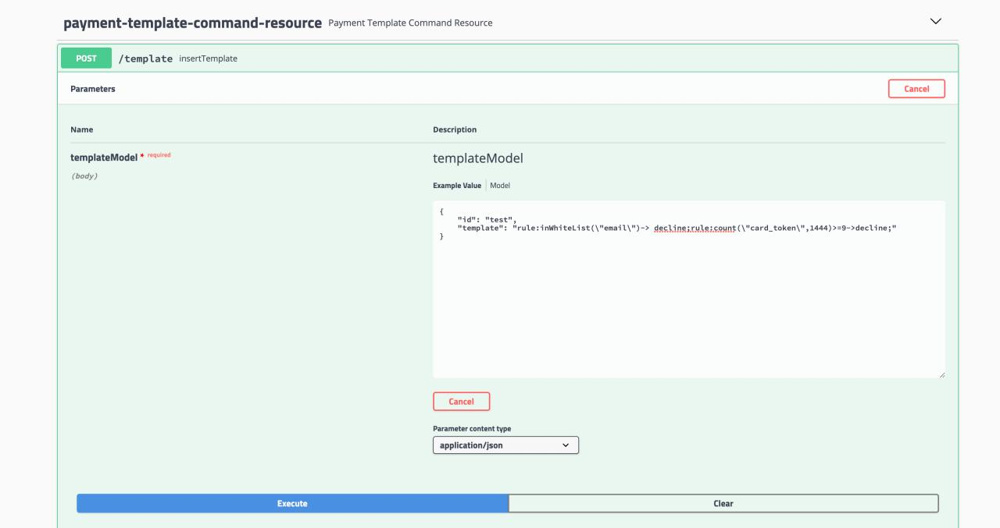
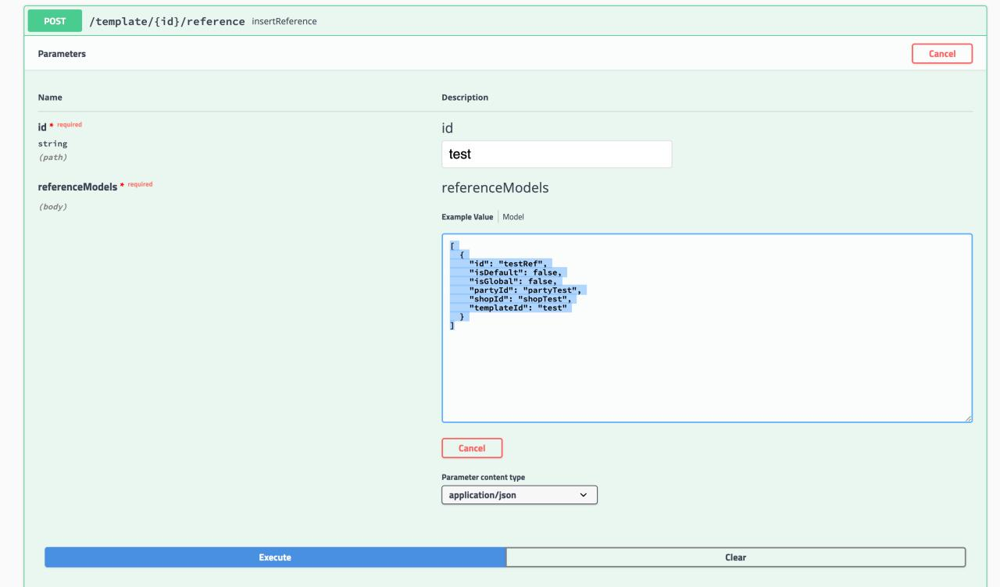
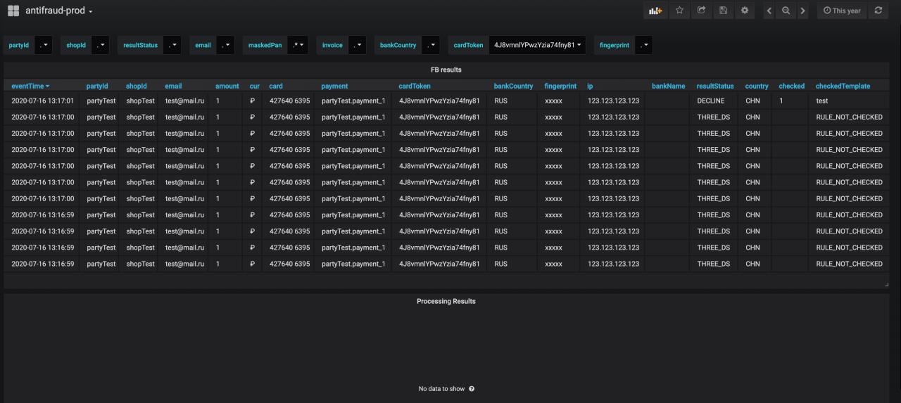

## Simple use case

    

1. Check all containers is running
2. Open swagger api http://localhost:8080/fb-management/v1/swagger-ui.html
3. Create new template:
    
    Template:
    ```
    rule:inWhiteList("email")->accept; // Check in white list by email, accept if exist 
    rule:count("card_token",1444)>=9->decline; // Check count 
    ```
   JSON template command:
    ```
   {
        "id": "test",
        "template": "rule:inWhiteList(\"email\")->accept;rule:count(\"card_token\",1444)>=9->decline;"
   }
   ```
   
    http://localhost:8080/fb-management/v1/swagger-ui.html#/payment-template-command-resource/insertTemplateUsingPOST_1

    

4. Create reference for party and shop:
   
   JSON template command:
   ```
   [
     {
       "id": "testRef",
       "isDefault": false,
       "isGlobal": false,
       "partyId": "partyTest",
       "shopId": "shopTest",
       "templateId": "test"
     }
   ]
   ```
   
    http://localhost:8080/fb-management/v1/swagger-ui.html#/payment-template-command-resource/insertReferenceUsingPOST_1

    
    
5. Use simple example test https://github.com/rbkmoney/fraudbusters-examples for emulate user

6. Open grafana admin/admin by url http://localhost:3000/d/EAj2Hjwix/antifraud-prod?orgId=1&from=now%2Fy&to=now%2Fy&var-partyId=.&var-shopId=.&var-resultStatus=.&var-email=.&var-maskedPan=.*&var-invoiceId=.&var-bankCountry=.&var-cardToken=4J8vmnlYPwzYzia74fny81&var-fingerprint=.

    