## Simple use case

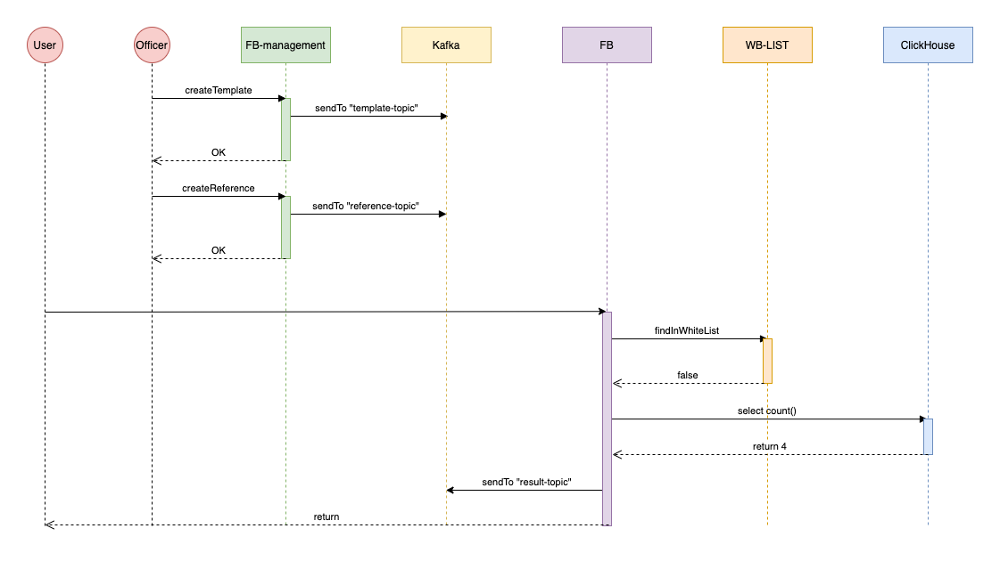

1. Check all containers is running
2. Open keycloak http://localhost:8080
3. Go to admin (admin/admin) &nbsp;

   &nbsp;
   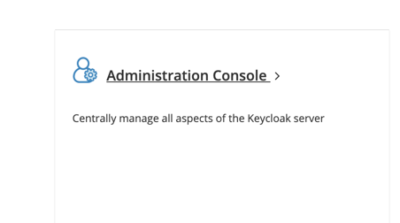
   &nbsp;
4. Link to add realm button &nbsp;

&nbsp;
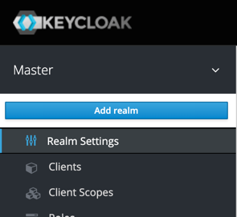
&nbsp;

5. Load realm from package - keycloak/realm-export.json &nbsp;

   &nbsp;
   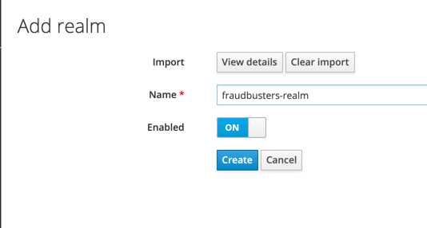
   &nbsp;
6. Add pattern for web origin &nbsp;

   &nbsp;
   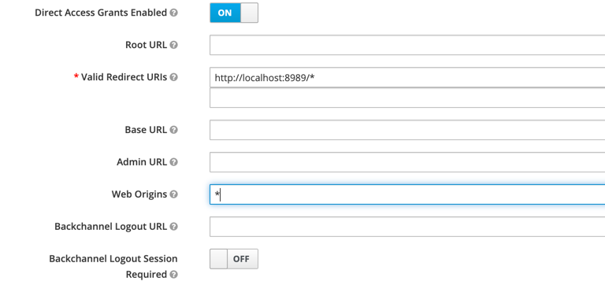
   &nbsp;
7. Go to users &nbsp;

   &nbsp;
   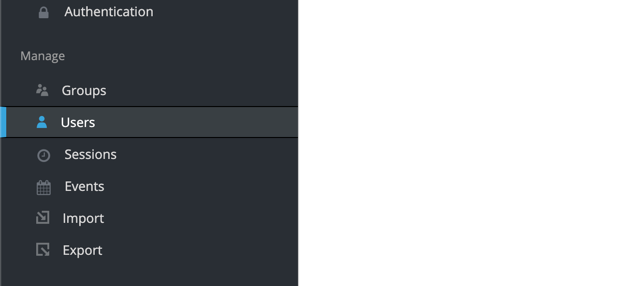
   &nbsp;

8. Click add user
9. Add credentials &nbsp;

   &nbsp;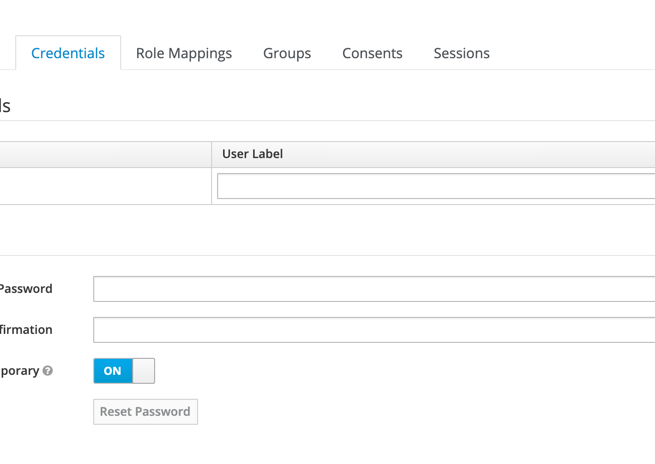
10. Add roles for user &nbsp;

&nbsp;
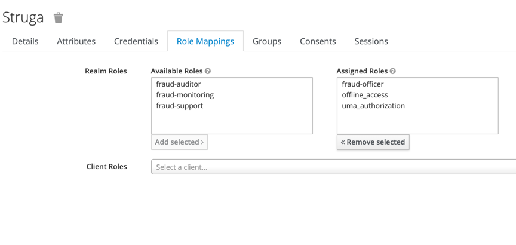
&nbsp;

11. Add to /etc/hosts ```127.0.0.1 keyclock```
12. Go to user interface and login as your user
13. Templates -> Create template name -
    ```test```
    template -
    ```rule:amount_test:amount >=1 -> decline;```

    &nbsp;
    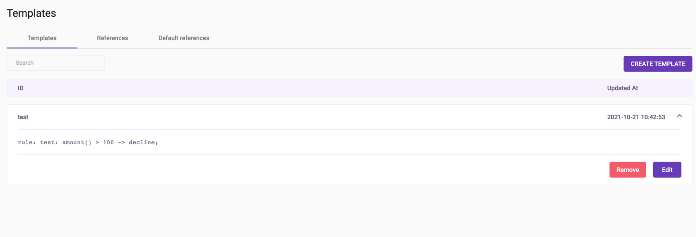
    &nbsp;
14. Reference -> Create reference Template id -
    ```test```
    Party id -
    ```partyTest```
    Shop id -
    ```shopTest```

    &nbsp;

    &nbsp;
    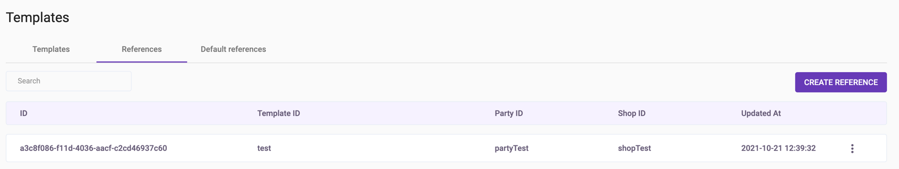
    &nbsp;

15. Use simple example test https://github.com/rbkmoney/fraudbusters-examples for emulate user

16. Historical data -> Inspect result
    &nbsp;

    &nbsp;
    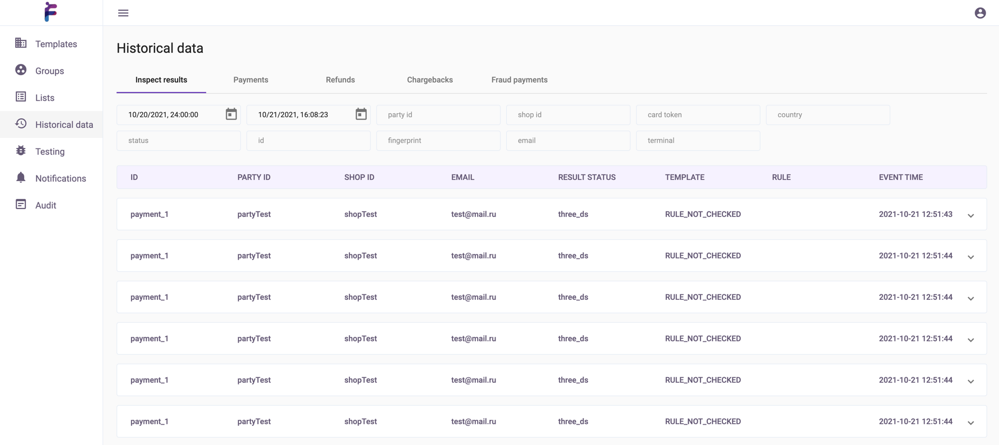
